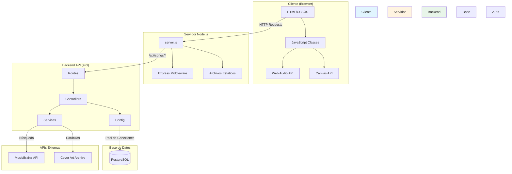
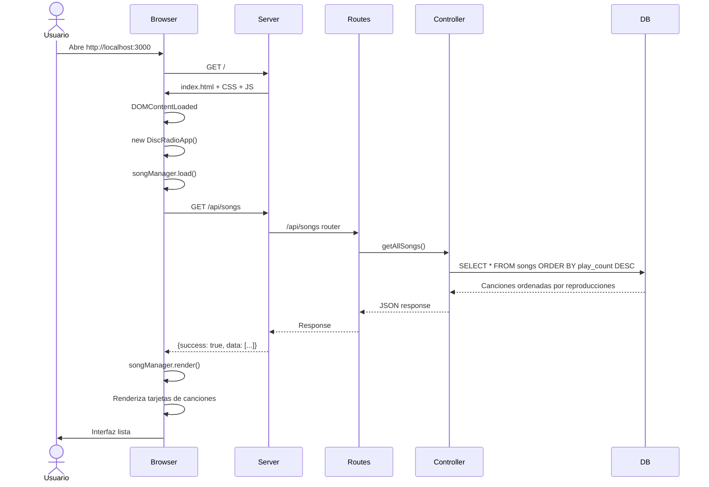

# Disc Radio 🎵

Aplicación web de radio con reproductor de audio, visualizador en tiempo real y gestión de canciones.

## Características

- 🎵 **Reproductor de Audio Completo** - Play, pause, siguiente, anterior, control de volumen y barra de progreso
- 🌈 **Visualizador en Tiempo Real** - 64 barras de frecuencia con colores tipo arcoíris que cambian dinámicamente
- 💿 **Extracción de Metadatos MP3** - Extrae portadas de álbum directamente de archivos MP3
- 🗄️ **Integración con PostgreSQL** - Gestión de canciones con base de datos
- 📱 **Diseño Responsive** - Compatible con móviles, tablets y desktop
- 🐳 **Containerizado con Docker** - Fácil deployment con Docker Compose
- 🎨 **Arquitectura Orientada a Objetos** - Código modular y mantenible

## Tecnologías

### Backend
- **Node.js** v20
- **Express.js** - Framework web
- **PostgreSQL** 16 - Base de datos
- **pg** - Cliente PostgreSQL para Node.js

### Frontend
- **HTML5** - Canvas API para visualizador
- **CSS3** - Animaciones y diseño responsive
- **JavaScript (ES6+)** - Programación orientada a objetos
- **Web Audio API** - Análisis de frecuencias en tiempo real
- **jsmediatags** - Extracción de metadatos ID3

### DevOps
- **Docker** & **Docker Compose** - Containerización
- **Adminer** - Gestión de base de datos

## Requisitos Previos

- Docker y Docker Compose instalados
- Puertos disponibles: 3000 (app), 5432 (PostgreSQL), 8080 (Adminer)

## Instalación

### 1. Clonar el repositorio

```bash
git clone https://github.com/idiegocs/radiocalico.git
cd radiocalico
```

### 2. Configurar variables de entorno

El archivo `.env` ya está configurado con valores por defecto:

```env
NODE_ENV=development
APP_PORT=3000

POSTGRES_USER=radio_user
POSTGRES_PASSWORD=dics
POSTGRES_DB=radiocalico_db
POSTGRES_PORT=5432

ADMINER_PORT=8080
```

**⚠️ IMPORTANTE**: Cambia la contraseña de PostgreSQL en producción.

### 3. Iniciar la aplicación

```bash
docker-compose up -d
```

### 4. Ejecutar migraciones

```bash
docker-compose exec -T db psql -U radio_user -d radiocalico_db < database/migrations/001_create_songs_table.sql
docker-compose exec -T db psql -U radio_user -d radiocalico_db < database/migrations/002_update_real_songs.sql
```

### 5. Acceder a la aplicación

- **Aplicación**: http://localhost:3000
- **Adminer** (BD): http://localhost:8080

## Uso

### Agregar Archivos de Audio

1. Coloca tus archivos MP3 en `public/audio/`
2. Actualiza la base de datos con la información de las canciones

```sql
INSERT INTO songs (title, artist, description, genre, duration, image_url, audio_file, spotify_url, youtube_url)
VALUES (
    'Nombre de la Canción',
    'Artista',
    'Descripción de la canción',
    'Género',
    '3:45',
    '/images/portada.jpg',
    '/audio/cancion.mp3',
    'https://open.spotify.com/...',
    'https://www.youtube.com/...'
);
```

### Desarrollo Local (sin Docker)

```bash
npm install
npm run dev
```

**Nota**: Necesitarás PostgreSQL instalado localmente y configurar `DATABASE_URL` en `.env`.

## Estructura del Proyecto

```
radiocalico/
├── src/                    # Código del backend
│   ├── config/
│   │   └── database.js     # Configuración de PostgreSQL
│   ├── controllers/
│   │   └── songsController.js  # Controladores de canciones
│   ├── routes/
│   │   └── songs.js        # Definición de rutas API
│   └── services/
│       └── coverArtService.js  # Servicio de búsqueda de carátulas
├── database/
│   └── migrations/         # Migraciones SQL
├── public/                 # Frontend estático
│   ├── audio/              # Archivos MP3
│   ├── css/
│   │   └── styles.css      # Estilos globales
│   ├── images/             # Imágenes y placeholders
│   ├── js/
│   │   └── app.js          # Código JavaScript modular
│   └── index.html          # Página principal
├── docker-compose.yml      # Configuración Docker Compose
├── Dockerfile              # Imagen de la aplicación
├── server.js               # Punto de entrada del servidor
├── package.json            # Dependencias
└── README.md               # Este archivo
```

## 📚 Documentación

### Diagramas de Arquitectura

#### Arquitectura General del Sistema



#### Flujo de Carga Inicial



### Documentación Completa

Para más diagramas y flujos detallados:

- **[Arquitectura Completa](docs/architecture.md)** - Todos los diagramas de arquitectura, capas, flujo de datos y patrones de diseño
- **[Diagramas de Secuencia](docs/sequence-diagrams.md)** - Flujos detallados de:
  - Carga inicial de la aplicación
  - Reproducción de canciones
  - Sistema de votación
  - Búsqueda de carátulas
  - Arquitectura backend

## Arquitectura del Código

### Backend (Node.js/Express)

La arquitectura del backend sigue el patrón **MVC (Model-View-Controller)** con separación de responsabilidades:

#### **Config (`src/config/`)**
- `database.js` - Pool de conexiones a PostgreSQL con event listeners

#### **Controllers (`src/controllers/`)**
- `songsController.js` - Lógica de negocio para canciones
  - `getAllSongs()` - Obtiene todas las canciones
  - `getSongById()` - Obtiene una canción por ID
  - `voteSong()` - Registra un voto
  - `registerPlay()` - Incrementa contador de reproducciones
  - `getCover()` - Busca carátula de álbum

#### **Routes (`src/routes/`)**
- `songs.js` - Define endpoints `/api/songs/*` y los conecta con controladores

#### **Services (`src/services/`)**
- `coverArtService.js` - Servicio desacoplado para búsqueda de carátulas
  - Integración con MusicBrainz + Cover Art Archive
  - Arquitectura extensible para agregar más proveedores (Spotify, Last.fm, etc.)

### Frontend (JavaScript OOP)

El código JavaScript del cliente está organizado en clases:

#### **`AudioVisualizer`**
Visualizador de audio en tiempo real con Web Audio API y Canvas.
- `setup()` - Configura el contexto de audio y analizador
- `animate()` - Dibuja 64 barras de frecuencia con gradientes
- `start()` / `stop()` - Controla la animación

#### **`AudioPlayer`**
Controla la reproducción y la interfaz del reproductor.
- `play()` - Reproduce una canción
- `togglePlayPause()` - Alterna entre play y pausa
- `extractAlbumArt()` - Extrae portadas de archivos MP3 con jsmediatags

#### **`SongManager`**
Gestiona canciones, votos y reproducciones.
- `load()` - Carga canciones desde la API
- `render()` - Renderiza tarjetas con descripción expandible
- `voteSong()` - Registra voto con animación
- `registerPlay()` - Incrementa contador de reproducciones

#### **`DiscRadioApp`**
Clase principal que orquesta toda la aplicación.

## API Endpoints

### Páginas

#### `GET /`
Página principal de la aplicación.

#### `GET /db-test`
Prueba de conexión a la base de datos.

### API REST

#### `GET /api/status`
Estado del servidor.

#### `GET /api/songs`
Obtiene todas las canciones con votos y reproducciones.

**Respuesta:**
```json
{
  "success": true,
  "count": 6,
  "data": [
    {
      "id": 1,
      "title": "Golden",
      "artist": "KPop Demon Hunters",
      "description": "...",
      "genre": "K-Pop",
      "duration": "3:28",
      "image_url": "/images/placeholder-1.svg",
      "audio_file": "/audio/golden.mp3",
      "spotify_url": "https://open.spotify.com/...",
      "youtube_url": "https://www.youtube.com/...",
      "votes": 42,
      "play_count": 156
    }
  ]
}
```

#### `GET /api/songs/:id`
Obtiene una canción específica por ID.

#### `POST /api/songs/:id/vote`
Registra un voto para una canción.

**Respuesta:**
```json
{
  "success": true,
  "message": "Voto registrado exitosamente",
  "data": {
    "id": 1,
    "votes": 43
  }
}
```

#### `POST /api/songs/:id/play`
Incrementa el contador de reproducciones de una canción.

**Respuesta:**
```json
{
  "success": true,
  "message": "Reproducción registrada exitosamente",
  "data": {
    "id": 1,
    "play_count": 157
  }
}
```

#### `GET /api/songs/:id/cover`
Busca la carátula del álbum usando MusicBrainz + Cover Art Archive.

**Respuesta (encontrada):**
```json
{
  "success": true,
  "coverUrl": "https://coverartarchive.org/release/.../front-500",
  "source": "coverartarchive",
  "release": "Album Name"
}
```

**Respuesta (no encontrada):**
```json
{
  "success": true,
  "coverUrl": null,
  "source": "none"
}
```

## Comandos Útiles

```bash
# Ver logs de la aplicación
docker-compose logs -f app

# Reiniciar servicios
docker-compose restart

# Detener servicios
docker-compose down

# Acceder al contenedor de la aplicación
docker-compose exec app sh

# Acceder a PostgreSQL
docker-compose exec db psql -U radio_user -d radiocalico_db

# Ver estado de los contenedores
docker-compose ps
```

## Esquema de Base de Datos

### Tabla `songs`

| Campo | Tipo | Descripción |
|-------|------|-------------|
| id | SERIAL | ID único (auto-incremental) |
| title | VARCHAR(255) | Título de la canción |
| artist | VARCHAR(255) | Nombre del artista |
| description | TEXT | Descripción de la canción |
| genre | VARCHAR(100) | Género musical |
| duration | VARCHAR(10) | Duración (formato: mm:ss) |
| image_url | VARCHAR(500) | URL de la portada |
| audio_file | VARCHAR(500) | Ruta al archivo MP3 |
| spotify_url | VARCHAR(500) | Enlace a Spotify |
| youtube_url | VARCHAR(500) | Enlace a YouTube |
| votes | INTEGER | Número de votos (me gusta) |
| play_count | INTEGER | Contador de reproducciones |
| created_at | TIMESTAMP | Fecha de creación |
| updated_at | TIMESTAMP | Fecha de actualización |

## Contribuir

1. Fork el proyecto
2. Crea una rama para tu feature (`git checkout -b feature/nueva-funcionalidad`)
3. Commit tus cambios (`git commit -m 'Add: nueva funcionalidad'`)
4. Push a la rama (`git push origin feature/nueva-funcionalidad`)
5. Abre un Pull Request

## Licencia

Este proyecto está bajo la Licencia MIT.

## Autor

**Diego Casteneda** - [idiegocs](https://github.com/idiegocs)

## Soporte

Si tienes algún problema o pregunta, abre un [issue](https://github.com/idiegocs/radiocalico/issues) en GitHub.

---

⭐ Si te gusta este proyecto, dale una estrella en GitHub!
