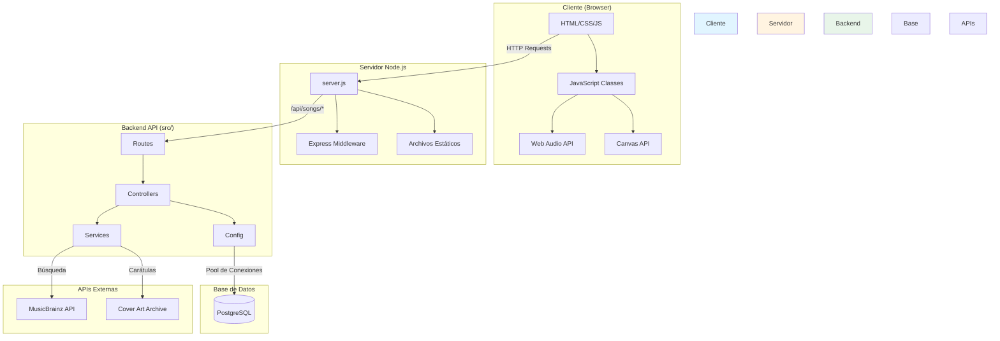
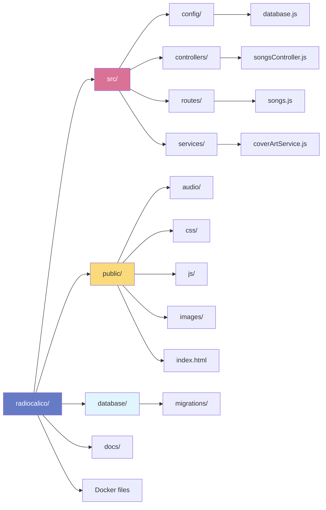
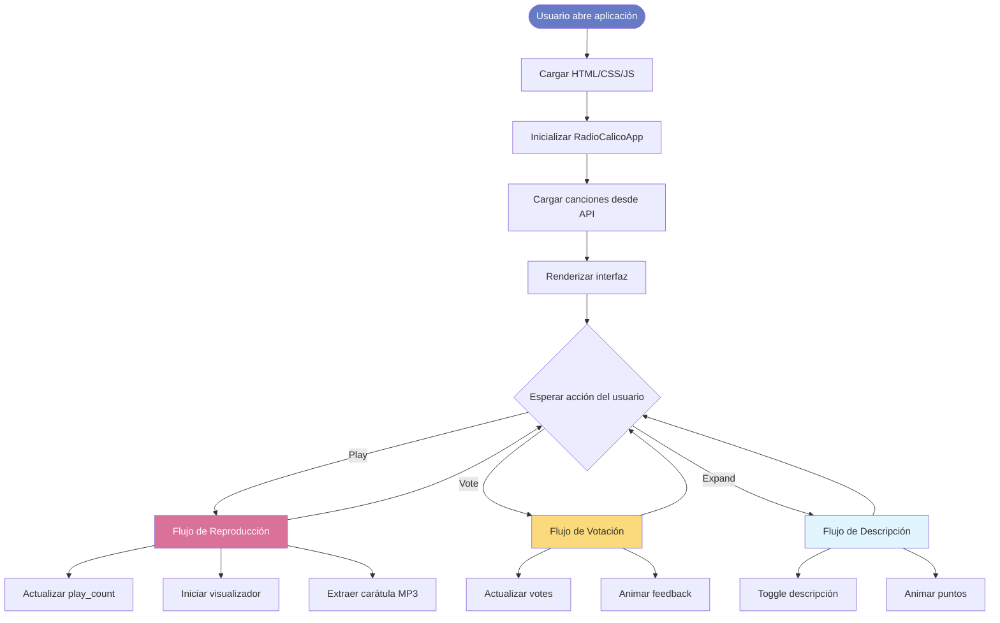
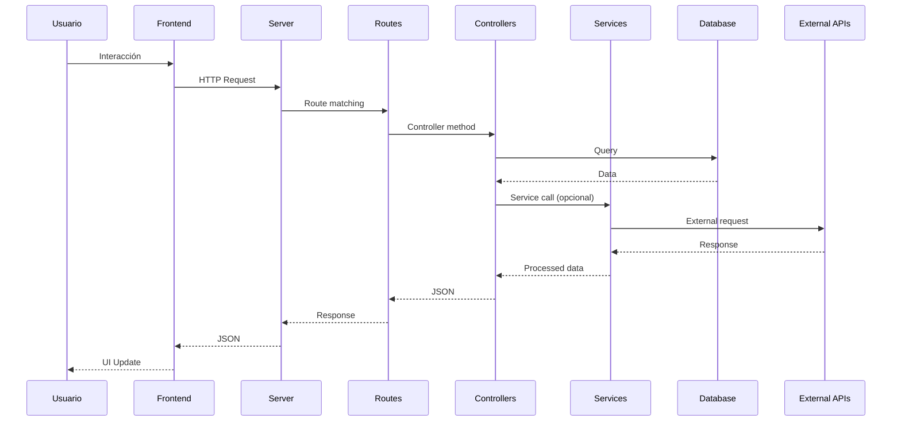

# Arquitectura de Disc Radio

## Diagrama de Arquitectura General



## Estructura de Carpetas



## Flujo de Datos



## Capas de la Aplicación

```mermaid
graph TB
    subgraph "Capa de Presentación"
        HTML[HTML5]
        CSS[CSS3 + Animaciones]
        UI[Interfaz de Usuario]
    end

    subgraph "Capa de Lógica (Frontend)"
        AppClass[RadioCalicoApp]
        PlayerClass[AudioPlayer]
        VisualizerClass[AudioVisualizer]
        ManagerClass[SongManager]
    end

    subgraph "Capa de Transporte"
        HTTP[HTTP/REST API]
        Fetch[Fetch API]
    end

    subgraph "Capa de Aplicación (Backend)"
        Express[Express Server]
        RoutesLayer[Routes Layer]
        ControllerLayer[Controller Layer]
    end

    subgraph "Capa de Servicios"
        CoverService[Cover Art Service]
        FutureServices[Servicios Futuros]
    end

    subgraph "Capa de Datos"
        PostgreSQLDB[(PostgreSQL)]
        ExternalAPIs[APIs Externas]
    end

    HTML --> CSS
    CSS --> UI
    UI --> AppClass
    AppClass --> PlayerClass
    AppClass --> VisualizerClass
    AppClass --> ManagerClass

    ManagerClass --> HTTP
    HTTP --> Fetch
    Fetch --> Express

    Express --> RoutesLayer
    RoutesLayer --> ControllerLayer
    ControllerLayer --> CoverService
    ControllerLayer --> PostgreSQLDB
    CoverService --> ExternalAPIs

    style Capa de Presentación fill:#e1f5ff
    style Capa de Lógica fill:#fff4e1
    style Capa de Transporte fill:#e8f5e9
    style Capa de Aplicación fill:#f3e5f5
    style Capa de Servicios fill:#ffe0e0
    style Capa de Datos fill:#fff9c4
```

## Patrones de Diseño Implementados

### 1. MVC (Model-View-Controller)

```
Model (Database)
  ↓
Controller (src/controllers/)
  ↓
View (Frontend HTML/JS)
```

### 2. Service Layer Pattern

```
Controller → Service → External API
                    ↓
                Database
```

### 3. Singleton Pattern

```javascript
// CoverArtService exporta una única instancia
class CoverArtService { ... }
module.exports = new CoverArtService();
```

### 4. Factory Pattern (Frontend Classes)

```javascript
// RadioCalicoApp crea instancias de otras clases
constructor() {
    this.visualizer = new AudioVisualizer(...);
    this.player = new AudioPlayer(...);
    this.songManager = new SongManager();
}
```

## Tecnologías por Capa

| Capa | Tecnología |
|------|------------|
| Frontend UI | HTML5, CSS3, JavaScript ES6+ |
| Frontend Logic | OOP JavaScript (Classes) |
| Visualización | Web Audio API, Canvas API |
| Transporte | Fetch API, REST |
| Backend Server | Node.js, Express.js |
| Backend Architecture | MVC + Service Layer |
| Base de Datos | PostgreSQL 16 |
| Containerización | Docker, Docker Compose |
| APIs Externas | MusicBrainz, Cover Art Archive |

## Comunicación entre Componentes



## Escalabilidad y Extensibilidad

### Agregar un nuevo controlador:

1. Crear `src/controllers/newController.js`
2. Definir métodos del controlador
3. Crear `src/routes/new.js`
4. Importar en `server.js`: `app.use('/api/new', newRoutes)`

### Agregar un nuevo servicio:

1. Crear `src/services/newService.js`
2. Implementar lógica de negocio
3. Importar en el controlador que lo necesite
4. El servicio es reutilizable en múltiples controladores

### Agregar un nuevo proveedor de carátulas:

1. Abrir `src/services/coverArtService.js`
2. Implementar método `searchSpotify()` o similar
3. Agregar al método `searchCover()` como fallback
4. **No tocar el controlador** - Desacoplamiento completo

## Seguridad

- Variables de entorno para credenciales (`.env`)
- Preparación de queries SQL (prevención de SQL injection)
- Validación de entrada en controladores
- CORS configurado en Express
- Pool de conexiones a DB con límites

## Performance

- Pool de conexiones a PostgreSQL (reutilización)
- Lazy loading de imágenes (`loading="lazy"`)
- Canvas optimizado con `devicePixelRatio`
- Event delegation para listeners
- Fetch API con promesas
- Singleton para servicios

---

*Documentación generada para Radio Calico v1.0*
