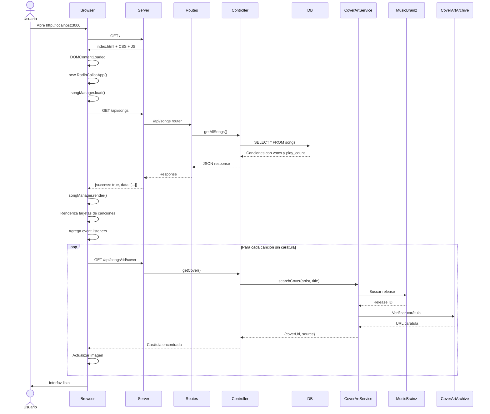
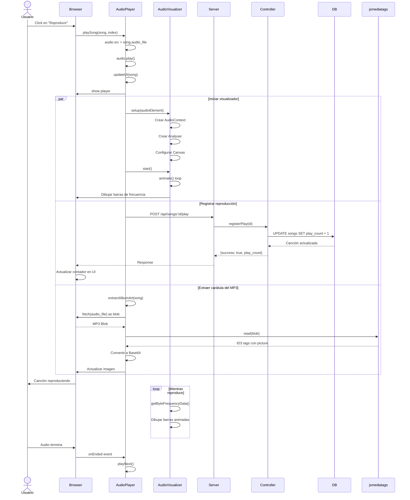
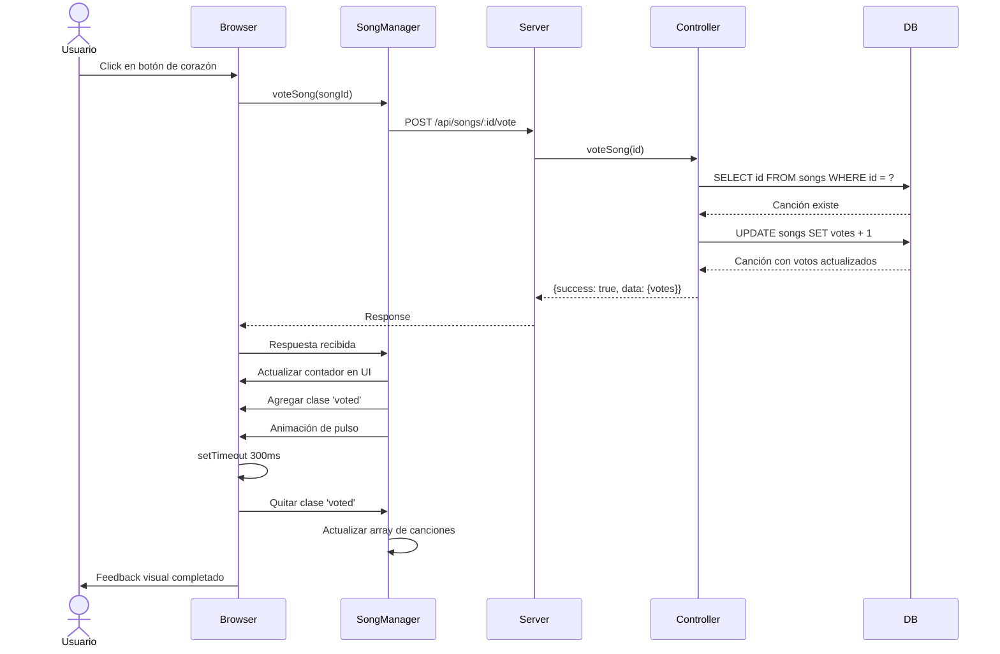
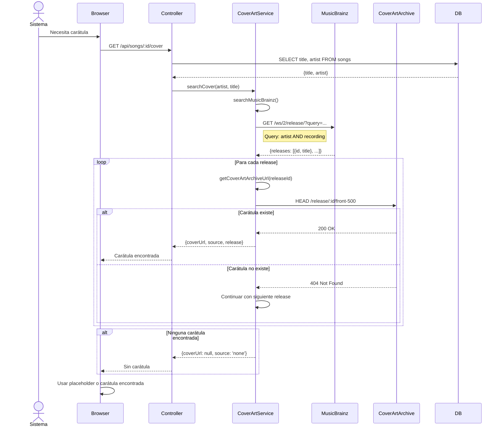
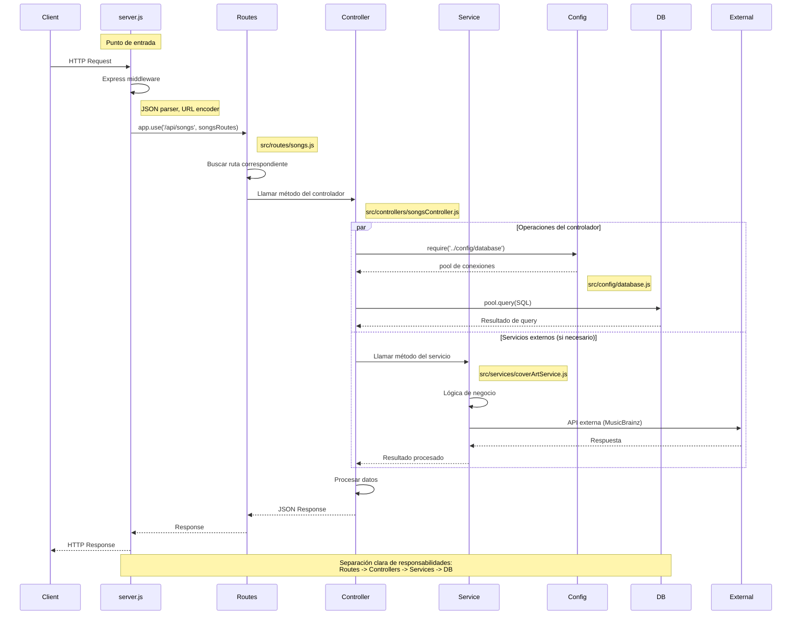
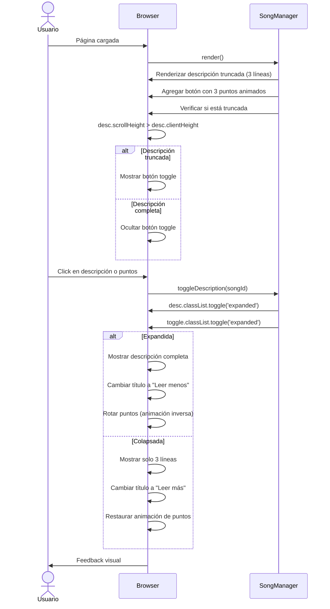

# Diagramas de Secuencia - Radio Calico

Este documento contiene los diagramas de secuencia que explican los principales flujos de la aplicación.

## Tabla de Contenidos
1. [Carga Inicial de la Aplicación](#1-carga-inicial-de-la-aplicación)
2. [Reproducción de una Canción](#2-reproducción-de-una-canción)
3. [Sistema de Votación](#3-sistema-de-votación)
4. [Búsqueda de Carátulas](#4-búsqueda-de-carátulas)
5. [Arquitectura Backend](#5-arquitectura-backend)

---

## 1. Carga Inicial de la Aplicación



---

## 2. Reproducción de una Canción



---

## 3. Sistema de Votación



---

## 4. Búsqueda de Carátulas



---

## 5. Arquitectura Backend



---

## 6. Descripción Expandible



---

## Notas de Implementación

### Tecnologías Utilizadas

- **Backend**: Node.js + Express.js
- **Frontend**: JavaScript ES6+ (Clases)
- **Base de Datos**: PostgreSQL
- **APIs Externas**: MusicBrainz + Cover Art Archive
- **Visualización**: Web Audio API + Canvas API

### Patrones de Diseño

1. **MVC (Model-View-Controller)**: Separación clara entre rutas, controladores y modelos
2. **Service Layer**: Lógica de negocio desacoplada en servicios reutilizables
3. **Singleton**: CoverArtService exporta una instancia única
4. **OOP**: Clases para AudioPlayer, AudioVisualizer, SongManager, RadioCalicoApp

### Flujo de Datos

```
Usuario → Browser (Frontend Classes)
  ↓
HTTP Request → Express Server
  ↓
Routes → Controllers → Services
  ↓
Database / External APIs
  ↓
JSON Response → Browser
  ↓
UI Update → Usuario
```

---

*Diagramas generados con [Mermaid](https://mermaid.js.org/)*
